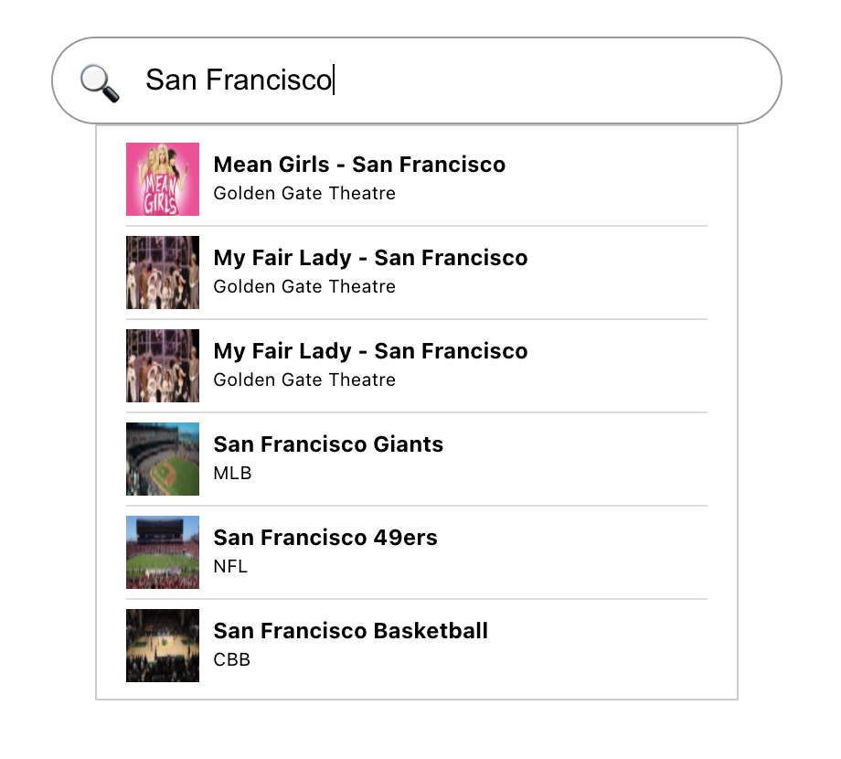

# Search for events

This application is built with React using React Hooks and including react-redux and @reduxjs/toolkit. It fetches a list of events in the format of a JSON file and displays them on a page sorted by event category.

Here is a screenshot:

  

## Viewing the app

In the project directory run:

### `npm start`

and open [http://localhost:3000](http://localhost:3000) to view it in the browser.
